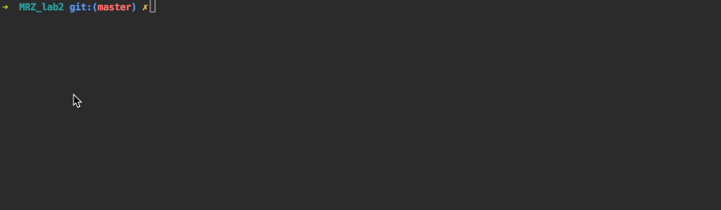

Recurrent network - sequence prediction
============
Progress:
------

Specifies the numerical sequence for which you want to predict the n-e number of items. Also, the following parameters are specified:
- The size of the window
- The number of hidden layer elements
- The maximum permissible error
- N, the number of elements to predict
- number of iterations

Elman neural network has 3 matrix of weighting coefficients:
1. Between input neurons and hidden layer, then W
2. Between contextual neurons and hidden layer, then U
3. Between the hidden layer and output, then W1 

The next step is to initialize the values ​​of the weights. Each weight is given a random value [-1, 1].
 
Result of work
-------
**The Fibonacci sequence**

_Network settings:_
 - Window size = 2;
 - Neurons number = 4;
 - Error = 0.0048;
 - Step = 0.00001;
 - Sequence (0, 1, 1, 2, 3, 5, 8, 13, 21, 34), 55, 89, 144, 233, 377, 610, 987, 1597, 2584, 4181, 6765, 10946
 - The sample for the study: the first 10 numbers of the sequence;
 - The number of iterations performed: 33412;

**Периодическая последовательность**

_Параметры сети:_ 
 - Window size = 4; 
 - Neurons number = 8; 
 - Error = 0.0001; 
 - Step = 0.000001; 
 - Sequence: (15,-13,6,47,15,-13,6,47,15,-13,6,47), 15, -13, 6, 47, ... 
 - The sample for the study: the first 12 numbers of the sequence;
 - The number of iterations performed: 56599;

**Факториал**	

_Параметры сети:_ 
 - Window size = 3; 
 - Neurons number = 6; 
 - Error = 0.05; 
 - Step = 0.000001;
 - Sequence: (1, 2, 6, 24, 120, 720, 5040), 40320, 362880, 3628800
 - The sample for the study: the first 7 numbers of the sequence;
 - The number of iterations performed: 56599;

Example
-------------

